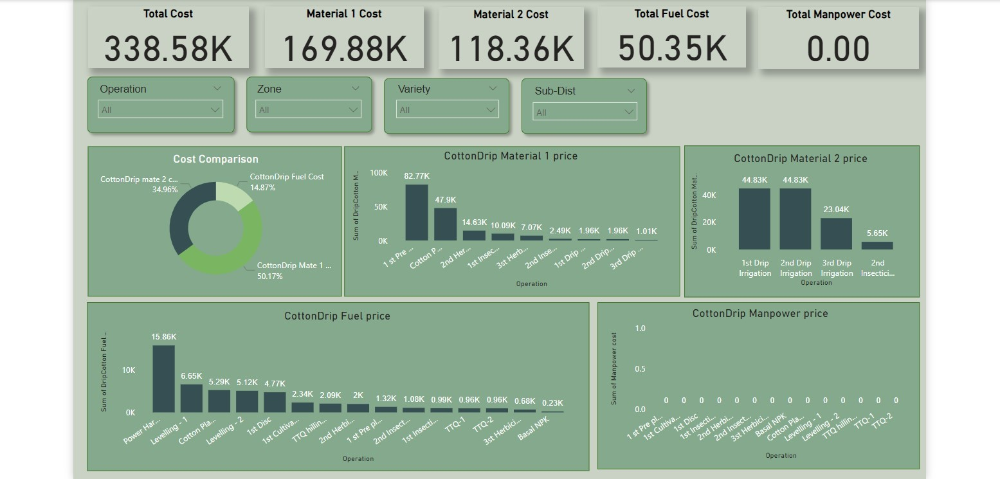

# 🌾 Crop Pricing Trends with Advanced Data Analysis Reports (Power BI)

A data-driven Power BI project analyzing operation-level cost structures across crop types — Cereals, Cotton, and Drip-Irrigated Cotton — built to support agricultural cost planning and pricing decisions at the district level.

---

## 👤 Role: Data Analyst

I led this project end to end — from data modeling to dashboard design — integrating multiple operational datasets (field activity logs, daily MIS sheets, and operations costing records) and delivering business-ready cost analysis reports.

---

## 📌 Project Description

This project analyzes the full cost breakdown of crop operations — material cost, fuel cost, and manpower cost — across three crop categories using **SQL**, **Excel**, and **Power BI**. I built a data model that integrated region-wise datasets, field activity tracking sheets, and operational costing records into a single interactive report. The result helps:

- Break down total cost into material, fuel, and manpower components by crop type
- Identify which specific operations (irrigation, planting, fungicide application, harvesting, etc.) drive the highest cost
- Compare cost structures across Cereals, regular Cotton, and Drip-Irrigated Cotton
- Support data-backed decisions for agricultural investment and pricing

---

## 📄 Dashboard Pages

### 1. Cereals — Cost Breakdown

Tracks total cost across material, fuel, and manpower for cereal crop operations, filterable by Operation, Variety, Counter, Crop Year, Sub-District, and Zone.

**Key metrics visible:**
- Total Cost: **1.69M** · Material 1 Price: **1.09M** · Material 2 Price: **74.86K**
- Total Manpower Price: **217.07K** · Total Fuel Cost: **309.08K**
- Cost Comparison: Material 1 accounts for **64.37%** of total cost, Fuel Cost **18.33%**, Manpower **12.87%**, Material 2 **4.44%**
- Highest Material 1 cost driver: **Seed** at 561.7K, followed by NPK 5:17:10 (186.1K) and Ammonium Nitrate (126.58K)
- Material 2 cost concentrated entirely in **Starane** at 75K
- Highest fuel cost operation: **Cereal planting** (68.902K), followed by Hilling up (42.517K) and Cultipacker (31.651K)
- Highest manpower cost operation: **1st Irrigation** (89K), followed by 3rd Irrigation (80K) and 4th Irrigation (34K)

---

### 2. Cotton — Cost Breakdown

The largest cost category in the report. Tracks the same material/fuel/manpower split for standard cotton operations, filterable by Operation, Zone, Variety, Sub-District, Crop Year, and Counter.

**Key metrics visible:**
- Total Cost: **3.26M** · Material 1 Cost: **2.53M** · Material 2 Cost: **8.57K**
- Total Fuel Cost: **520.62K** · Total Manpower Cost: **199.34K**
- Cost Comparison: Material 1 dominates at **77.66%** of total cost, Fuel Cost **15.97%**, Manpower **6.11%**
- Highest Material 1 cost driver: **Basal application** at 886.79K, followed by Cultivation (317.02K) and a cotton-specific operation (194.74K)
- Material 2 cost entirely from **BT+BW** seed variety at 8.57K
- Highest fuel cost operation: **Hilling** (78.78K), followed by TTQ (58.1K) and Cultivation passes (46.38K)
- Highest manpower cost operations: **Pre-Irrigation** (79K) and **1st Cotton operation** (77K), followed by 1st Irrigation (31K)

---

### 3. Cotton Drip — Cost Breakdown

A separate cost model for drip-irrigated cotton, isolating the impact of drip infrastructure on material and fuel costs versus traditional cotton. Notably, manpower cost is recorded at zero across all operations — reflecting the reduced labor requirement of drip irrigation.

**Key metrics visible:**
- Total Cost: **338.58K** · Material 1 Cost: **169.88K** · Material 2 Cost: **118.36K**
- Total Fuel Cost: **50.35K** · Total Manpower Cost: **0.00**
- Cost Comparison: Material 1 makes up **50.17%** of total cost, Material 2 **34.96%**, Fuel **14.87%**
- Highest Material 1 cost driver: **1st Pre-application** at 82.77K, followed by Cotton Planting (47.9K)
- Material 2 cost driven by drip irrigation cycles: 1st Drip Irrigation (44.83K), 2nd Drip Irrigation (44.83K), 3rd Drip Irrigation (23.04K)
- Highest fuel cost operation: **Power Harrowing** (15.86K), followed by Levelling (6.65K)
- **Zero manpower cost** recorded across every operation — the clearest cost advantage of the drip system over traditional cotton

---

## 🛠️ Tools & Skills Used

- Microsoft Power BI
- Microsoft Excel
- SQL (for preprocessing and transformations)
- Data Modeling
- Interactive Data Visualization
- Data Cleaning & Integration

---

## 📊 Deliverables

- ✅ Power BI Dashboard (`.pbix`)
- ✅ Cleaned and formatted Excel datasets (field activity tracking, daily MIS, operations costing)
- ✅ Three comparative cost reports — Cereals, Cotton, and Cotton Drip
- ✅ Operation-level cost breakdown for material, fuel, and manpower across all crop types

---

## 🔍 Insights Provided

- Which operations drive the highest material, fuel, and manpower cost within each crop type?
- How does the cost structure of drip-irrigated cotton compare to traditionally irrigated cotton?
- Where is manpower cost concentrated, and where can drip infrastructure reduce it to zero?
- Which crop type carries the highest material cost burden relative to total cost?

---

## 👤 About

Built by **Md Arshad Ahammed (Ash)** — Data Analyst specialising in Power BI, SQL, Excel, and agricultural/operations cost analysis.

📬 [arshadadvisory.com](https://arshadadvisory.com)
